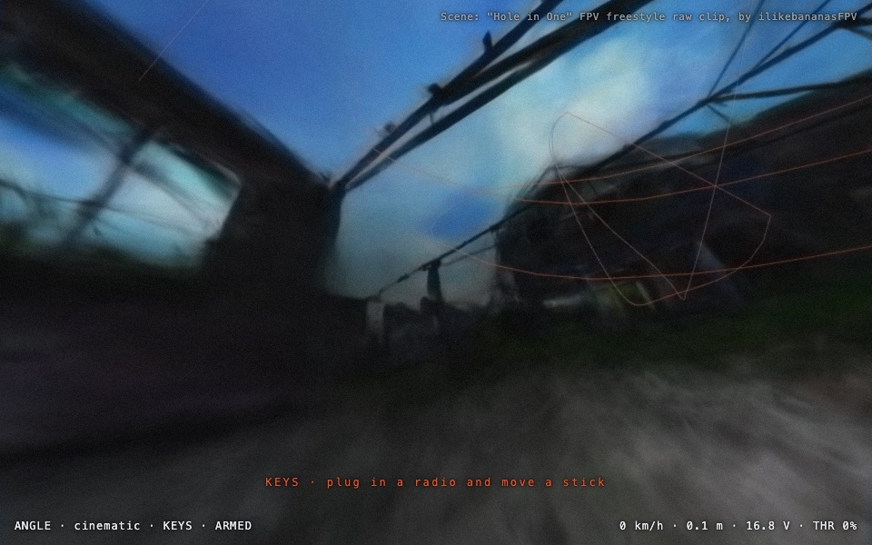

# M2: a video becomes a place you can fly

Written 2026-09-15. DRI: Lacy.

One sentence: point the pipeline at a bando video, wait, and the sim opens
that building with the original pilot's line drawn through it.

## The person and the moment

An FPV pilot found a bando flight on YouTube and wants to fly that building
tonight with their own radio. They will not get that in the browser tab: a
reconstruction is hours of compute, and there is no money for a server to do
it on. So the promise is smaller and kept whole: one command on their own
machine turns the video into a folder, and the sim opens the folder.

## The first ten seconds

**In the terminal.** One command, one line per stage, and a last line that
says where the scene went and how to open it. A stage that fails says what
to try, because the failures here are known: too few frames registered,
Brush not installed, the scale off by two.

```
fpvreal-scene "https://www.youtube.com/watch?v=XRcnQfmXYAA" --from 10 --to 70
[     1s] fetch   https://www.youtube.com/watch?v=XRcnQfmXYAA
[     9s] frames  4.0 fps, 1280 px wide, 10s to 70s
[    20s] frames  195 kept, 45 blurred frames dropped
[    21s] colmap  features, OPENCV_FISHEYE
...
[  3801s] done    copy scenes/hole-in-one into sim/public/scenes/ and open http://localhost:5173/?scene=/scenes/hole-in-one/
```

**In the browser.** `?scene=` opens the folder. The boot screen counts the
splat in, the pad search puts the quad on the floor under the pilot's first
frame, the ghost line is there in the accent colour, and the credit names
the video and its author. Arm and fly. Nothing else on the screen changed.

## What was removed

- **Paste a link in the browser.** Not possible on this budget. The map
  screen stays as it is; a scene opens by URL. When there is a place to run
  the pipeline for people, the map screen gets a second box.
- **The moving ghost replay.** The line first. A quad flying the line at
  video time is the M3 racing ghost; building it twice is a waste.
- **A scale slider in the setup panel.** Scale is a pipeline output. It is
  printed, written into scene.json in the open, and corrected with `--speed`.
- **VGGT and MASt3R.** Both want a CUDA card. The machine this was built on
  is an M1 with 16 GB. COLMAP and Brush run on it. The pipeline's stages are
  files on disk, so a better pose estimator is a swap of one stage later.
- **Gates along the path.** M3.
- **A share format.** The folder is the format for now.

## How it works

`pipeline/` is a Python package on uv, one command `fpvreal-scene`. Six
stages, each cached on disk so a rerun picks up where it stopped.

| stage | tool | what comes out |
|---|---|---|
| fetch | yt-dlp | `source.mp4`, the title and author for the credit |
| frames | ffmpeg | stills at 4 fps, 1280 px wide; the blurriest third of the clip's own distribution is dropped |
| colmap | COLMAP 4.2, CPU SIFT | poses with one shared fisheye camera, sequential matching, undistorted to pinhole |
| brush | Brush 0.3 on Metal | `splat.ply`, 15,000 steps, capped at 800,000 splats |
| align | numpy | the transform from COLMAP's frame to sim metres |
| mesh | scikit-image | `collision.bin`, a marching-cubes surface over the solid splats near the flown path |

**Down** comes from the pilot. An FPV camera is bolted on with a tilt and
no roll, so over a flight the camera's right vector sweeps the horizontal
plane while the pilot yaws. The normal of that plane is gravity. Rolled
frames (a flip, a knife edge) are weighted out. The pipeline prints the
camera tilt it implies; an FPV camera reads between 15 and 40 degrees, and
anything else is the warning that the up vector is wrong.

**Scale** comes from the clock. The frames are timestamped, the poses have
distances, and a pilot cruising a bando moves at roughly 8 m/s. The median
speed in reconstruction units against that number is the scale. It is a
guess and it is written down as one in `scene.json`, so `--speed 12` fixes a
scene that feels small.

**The ground** is the splat, voxelised. Splats with opacity above 0.5 within
15 m of the flown path are stamped into a 0.25 m grid, connected blobs
smaller than 12 voxels are dropped as floaters, the grid is blurred and a
surface is pulled out with marching cubes, then decimated to 250,000
triangles. A floor under everything catches whatever the reconstruction
missed.

**The scene folder** is three files. `scene.json` (format, name, credit,
source, the splat transform, the scale and how it was guessed, the flown
path as `[t, x, y, z]` in metres, the mesh counts), `splat.ply`, and
`collision.bin` (float32 vertices then uint32 indices, nothing else).

In the sim, `scene-splat.js` opens the folder: Spark renders the splat in
the same Three.js scene the lens already composes, Rapier gets the trimesh
as the ground collider, and the pad search from M1 runs against it near the
path's first point. The frame loop is the same loop; the streaming window is
simply absent.

## Known limits, on purpose

- A freestyle clip full of flips and dives registers worse than a cruise.
  `--from`/`--to` picks the cruising section.
- YouTube footage is compressed, often stabilised, sometimes dewarped. The
  camera model is a flag.
- Splats do not write depth, so the ghost line shows through walls. That is
  what a ghost does.
- The splat is 200 MB as a PLY. Compression is a stage to add, not a change
  to the format.
- Interiors reconstruct better than skies: the floaters in the sky are
  dropped from the collision mesh and left in the picture.

## Demo test

1. Ten seconds: terminal, one command, one line per stage; browser, the boot
   count, the pad, the line.
2. Removed: the list above.
3. One action per screen: the command; arm.
4. Defaults: 4 fps, 1280 px, fisheye, 8 m/s, 15,000 steps, 800k splats.
5. States: not installed (says what to install), download fails (says to
   update yt-dlp), too few frames registered (says which flags), no ground
   under the first frame (says the scale or up is off), a folder that is not
   a scene (says what format it expected).
6. Feedback: a line per stage, a percentage while the splat streams in.
7. Seams: the boot copy, the accent colour and the credit line match the
   place mode. The terminal's voice matches the sim's.
8. Stage test: the pilot's line through a real bando, with the sim's
   camera looking down it.
9. Evidence: `docs/m2-hole-in-one.jpg` and the pipeline log.
10. DRI: Lacy.

## The first run, 2026-09-15

The clip: "Hole in One" by ilikebananasFPV, a daylight brick bando with a
steel truss roof, raw 4:3 fisheye, seconds 12 to 42. The machine: an M1
with 16 GB, shared with other work at a load average between 40 and 170.

| stage | result |
|---|---|
| frames | 300 extracted at 10 fps, 250 kept |
| colmap | 198 of 250 registered in one model, focal converged to 407 px |
| brush | 15,000 steps, 800,000 splats, 189 MB, 2 h 46 min on the contended GPU |
| align | 88% of the scene below the pilot, floor 11.7 m below the first frame |
| mesh | 47,160 voxels, 114,096 triangles |
| browser | booted in 6 s, pad on the floor the pilot dived to |



What it taught, all in the tree now:

- COLMAP 4 marks every fisheye pair degenerate without a focal length
  prior. Half the frame width is close enough; bundle adjustment finds the
  rest. A first run at 4 fps with no prior registered nothing.
- Fast FPV wants 10 fps and a wider match window. At 4 fps the same clip
  fragmented into models of 60, 28, 16 and 10 frames.
- The "camera tilt" check was wrong. The mean of forward against up is the
  pilot's average look pitch, and this pilot looks 17 degrees below the
  horizon because the clip is dives. The sign of up now comes from the
  points: a pilot flies above most of the scene.
- Brush's splats are mostly faint. Only 1.7% have opacity above 0.5, so a
  threshold on single splats left crumbs. Voxels accumulate opacity instead
  and a wall of faint splats adds up to a wall.
- The pilot's first frame is not the floor. This clip starts over the roof.
  The pipeline now writes the fitted floor height and where the pilot flew
  lowest, and the sim searches for a pad there, with a window that keeps
  the safety net out of reach (the first spawn landed on the net, 26 m under
  the building, because it was the lowest, most open ground there was).
- Brush prints nothing while it trains. It now exports five times along the
  way and each export is a progress line with an estimate of what is left.

Still open: the scale is a guess (this scene reads plausible at 8 m/s, and
the 25 m by 25 m by 27 m path box suggests it may be up to 1.5 times too
large), the splat is soft at 15,000 steps, and nobody has flown it with a
radio yet.
